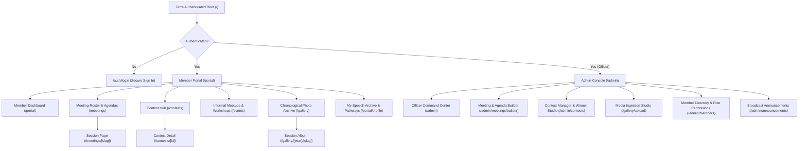
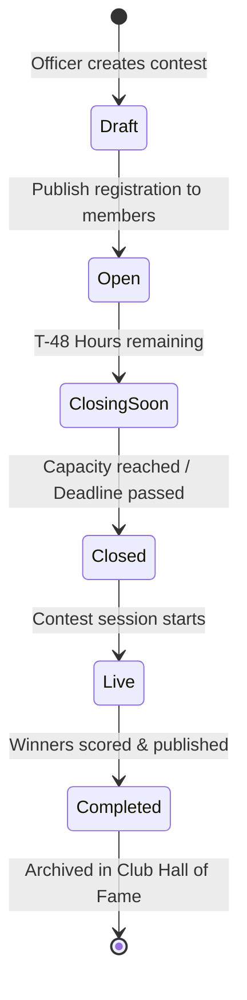

# TERRA — 10-HOUR PRODUCT DESIGN SPRINT
## The Private Apple-Inspired Club Operating System for Terra Toastmasters

---

## Executive Summary & Product Vision

**Terra** is a high-precision, **100% private, authenticated club operating system** designed exclusively for the members and club officers of Terra Toastmasters. By eliminating public marketing fluff and external guest portals, Terra focuses 100% of its surface area on **member utility, meeting execution, role volunteering, contest orchestration, and rich media archiving**.

The interface combines **Apple-inspired industrial elegance** (monochrome precision, deep optical contrast, dynamic SF typography, refined frosted micro-surfaces) with **modern interactive component patterns inspired by 21st.dev** (fluid bento grids, spring-physics modals, tactile segmented controls, contextual in-meeting action docks).

This document serves as the **10-Hour Execution Blueprint** tailored specifically for an internal, authenticated club management platform.

---

```
┌──────────────────────────────────────────────────────────────────────────────────────────────────┐
│                                   TERRA PLATFORM ARCHITECTURE                                    │
│                              (100% Authenticated Member & Admin Hub)                             │
├──────────────────────────────────────────────────────────────────────────────────────────────────┤
│                                                                                                  │
│  ┌──────────────────────────────────────────────┐   ┌─────────────────────────────────────────┐  │
│  │                MEMBER PORTAL                 │   │              ADMIN CONSOLE              │  │
│  │  • Next Meeting Command Center               │   │  • Dynamic Drag-and-Drop Agenda Builder │  │
│  │  • Real-Time Self-Serve Role Claiming        │   │  • Role Assignment & Override Engine    │  │
│  │  • Contest Hub & Category Signups            │   │  • Contest Orchestration & Scoring      │  │
│  │  • Informal Event & Workshop RSVPs           │   │  • S3 Media Ingestion & Auto-Filing     │  │
│  │  • Session-Linked Photo Archive & Lightbox   │   │  • Member Directory & RBAC Permissions  │  │
│  │  • Personal Speech Archive & Pathway Tracker │   │  • Broadcast Announcements & Alerts     │  │
│  └──────────────────────────────────────────────┘   └─────────────────────────────────────────┘  │
│                                                                                                  │
│  ┌────────────────────────────────────────────────────────────────────────────────────────────┐  │
│  │                                TERRA CORE ENGINE & DATABASE                                │  │
│  │  • JWT/Session Auth • PostgreSQL Schema • Role Mutex Locks • S3 Media Pipeline • Real-time  │  │
│  └────────────────────────────────────────────────────────────────────────────────────────────┘  │
└──────────────────────────────────────────────────────────────────────────────────────────────────┘
```

---

# 10-Hour Hour-by-Hour Execution Plan

```
┌───────┬──────────────────────────────────────────┬───────────────────────────────────────────┐
│ HOUR  │ PHASE & FOCUS                            │ PRIMARY DELIVERABLE                       │
├───────┼──────────────────────────────────────────┼───────────────────────────────────────────┤
│ 01    │ Private Scope, Personas & Assumptions    │ Product Charter & MoSCoW Scope Matrix     │
│ 02    │ Information Architecture & Gated Routing │ Master Sitemap, Content Graph & Routes    │
│ 03    │ User Flows & State Logic                 │ 8 Detailed Flowcharts & Edge Case Rules   │
│ 04    │ Design Tokens & Component System         │ Apple/21st.dev UI Kit & Token Tokens      │
│ 05    │ Member Command Center & Speech Portfolio │ Member Dashboard, Profile & Pathway Specs │
│ 06    │ Meeting Engine & Agenda Builder          │ Meeting Detail, Roster & Admin Builder    │
│ 07    │ Contests & Informal Events Engine        │ Contest Lifecycle & Event RSVP Specs      │
│ 08    │ Media Gallery & Chronological Pipeline   │ S3 Storage Specs & Lightbox Gallery UI    │
│ 09    │ Mobile In-Meeting Assistant & UX States  │ Mobile Action Sheet, Empty/Error Specs    │
│ 10    │ Technical Blueprint & Handoff Package    │ PostgreSQL Schema, API Spec & Handoff     │
└───────┴──────────────────────────────────────────┴───────────────────────────────────────────┘
```

---

## Hour 01 — Private Scope, Personas & Assumptions

### Objective
Establish the foundational boundaries, member/officer personas, operational constraints, and feature prioritization for Terra as a private, authenticated club operating system.

### Tasks
1. **Define Core Value Proposition**: Clarify Terra's identity as a *pure internal productivity platform* designed to streamline meeting operations, role assignments, contest registrations, and photo archiving without any public marketing overhead.
2. **Profile Primary Personas**:
   - *Active Member (Elena)*: Needs a 10-second flow on mobile or desktop to claim meeting roles, check live agenda timings during meetings, sign up for speech slots, view past evaluations, and access meeting photo albums.
   - *Club Officer / Admin (Vice President Education - Marcus)*: Needs a drag-and-drop agenda builder, rapid speaker confirmation tools, contest management, attendance logging, and media ingestion controls.
   - *Club President / VP PR (Sophia)*: Needs quick announcement broadcasts, meeting duplication tools, and club memory curation.
3. **Draft the MoSCoW Scope Matrix (Private Platform)**:
   - **Must Have (MVP)**: Secure authentication (Email/Password + JWT), Meeting creation & dynamic Agenda builder, Real-time Role Claiming with conflict prevention, Informal Event RSVPs, Contest Registration with lifecycle states, Structured Chronological Photo Gallery with session-binding, Member Dashboard, Personal Speech History.
   - **Should Have (v1.1)**: Automated WhatsApp/Email agenda ping 24 hours prior, Meeting Duplication/Template engine, Photo tagging by member ID, Printable 1-page PDF Agenda generator.
   - **Could Have (v1.2)**: Toastmasters Pathway progress tracking (Levels 1–5), In-meeting live timer tool, Member participation statistics.
   - **Won't Have (Initial Sprint)**: Public landing pages, guest RSVP forms, external marketing pages, payment/dues processing.
4. **Define Operating Assumptions & Club Cadence**:
   - Access to Terra is strictly invite-only / member-approved.
   - Unauthenticated visitors hitting any URL are immediately redirected to `/auth/login`.
   - Standard meetings occur bi-weekly on designated days (e.g., alternating Tuesdays 7:00 PM – 9:00 PM).

### Design Output
- **Private Product Charter**: Mission statement focused on internal club excellence and high-utility operations.
- **Member & Officer Persona Cards**: Visual profiles detailing JTBD, mobile in-meeting contexts, and friction points with legacy systems (Easy-Speak).
- **MoSCoW Matrix**: Categorization of all 36 core internal features.

### Decisions That Must Be Made
1. *Authentication Model*:
   - **Decision**: Strict authentication wall. No unauthenticated routes exist except `/auth/login` and `/auth/forgot-password`. New member accounts are provisioned by club officers or registered via an invite link.
2. *Role Claiming Governance*:
   - **Decision**: Hybrid Model. Standard functional roles (Timer, Ah-Counter, Grammarian, Table Topics Master, Evaluators) are **instant-claim** on a first-come, first-served basis. High-stakes roles (Toastmaster of the Day, Prepared Speakers) are **instant-claim with soft admin override** (VPE is notified and can reassign).

### Completion Criteria
- [x] Internal-only product charter finalized.
- [x] Member & Officer personas and JTBD documented.
- [x] Scope boundary locked (100% private club portal).

### Recommended Tools & Skills
- **Skill**: `senior-architect`, `frontend-design`
- **Tools**: Markdown canvas, Notion/FigJam workspace mapping, Apple HIG guidelines.

---

## Hour 02 — Information Architecture, Gated Routing & Content Graph

### Objective
Construct the structural skeleton, routing map, and relational content models across authenticated Member and Admin surfaces.

### Tasks
1. **Architect the Gated Sitemap**:
   - Map all 16 private views across 2 distinct security tiers (Authenticated Member, Officer/Admin).
2. **Develop URL Route Architecture**:
   - Root `/` automatically resolves to `/portal` for authenticated users or `/auth/login` for unauthenticated sessions.
   - Standardized RESTful routing (`/meetings/[slug]`, `/contests/[id]`, `/events/[id]`, `/gallery/[year]/[slug]`, `/portal/profile`).
3. **Define Relational Content Graph**:
   - Establish entities and foreign-key relationships: `User` ↔ `MemberProfile` ↔ `Meeting` ↔ `MeetingRole` ↔ `AgendaItem` ↔ `Contest` ↔ `ContestParticipant` ↔ `MediaAlbum` ↔ `MediaAsset`.
4. **Design Navigation Topography**:
   - *Desktop*: Top-anchored blurred navigation bar (`backdrop-blur-md bg-white/80 dark:bg-black/80`) with active pill indicator, search command palette (`⌘K`), notification center, and profile dropdown.
   - *Mobile*: Bottom tab bar with 4 primary destinations (`Home`, `Meetings`, `Contests`, `Gallery`) + floating contextual action trigger (`Claim Role` / `Upload`).

### Visual Architecture Sitemap



### Design Output
- Complete Gated Sitemap Diagram with zero public leaves.
- RESTful Route Registry table with auth middleware policies.
- Relational Content Model (ERD).

### Decisions That Must Be Made
1. *Media Taxonomy Hierarchy*:
   - **Decision**: Standardize on **Chronological Session-Anchored Albums**: `Year -> Month -> Session_Slug -> Photos`. All photos belong to a specific `MeetingID` or `EventID`.
2. *Default Landing Destination*:
   - **Decision**: Authenticated members always land on `/portal` (the Member Command Center). Officers have an instant-toggle switch in the header to switch between Member View and Admin Console.

### Completion Criteria
- [x] Sitemap covers 100% of internal club operations without unauthenticated leakages.
- [x] Route table defined with HTTP paths and auth middleware guards.

### Recommended Tools & Skills
- **Skill**: `senior-architect`, `backend-patterns`
- **Tools**: Mermaid graph syntax, Figma FigJam.

---

## Hour 03 — Core User Flows, State Machines & Interaction Logic

### Objective
Map step-by-step user journeys and deterministic state machines for high-frequency internal workflows, defining edge cases, error fallbacks, and validation constraints.

### Tasks
1. **Flow 1: Self-Serve Meeting Role Claiming & Cancellation**:
   - Step 1: Member views `/meetings/2026-08-18`.
   - Step 2: Open roles display green `Claim Role` buttons; occupied roles display member avatar and name.
   - Step 3: Member clicks `Claim Role` on "Evaluator 2".
   - Step 4: Optimistic UI lock + optional speech title/pathway project input modal.
   - Step 5: Slot commits as `Occupied (Elena)`; VPE receives activity log entry.
   - *Edge Case Flow*: Dropping a claimed role within 48h triggers a warning modal: *"Meeting starts soon. Please inform the Toastmaster of the Day before dropping."* Slot is freed with an orange `Vacant Role` tag.
2. **Flow 2: Admin Meeting Creation & Dynamic Agenda Building**:
   - Step 1: Officer clicks `+ Create Meeting`.
   - Step 2: Selects Template (`Standard 3-Speaker`, `Contest Special`, `Workshop`, or `Duplicate Previous`).
   - Step 3: Configures Date, Time, Venue/Zoom link, Theme, and Word of the Day.
   - Step 4: Agenda builder initializes auto-calculating timed agenda blocks.
   - Step 5: Publishes session; notification ping generated for club members.
3. **Flow 3: Contest Lifecycle & Registration**:
   - State Machine: `Draft` → `Open for Registration` → `Registration Closing Soon (48h)` → `Registration Closed (Locked)` → `Live in Progress` → `Completed (Results Published)`.
   - Prevents duplicate entries via compound database constraints `(contest_id, user_id)`.
4. **Flow 4: Photo Ingestion, Batch Upload & Auto-Filing**:
   - Drag-and-drop batch uploader (client-side WebP compression, EXIF extraction, progress indicator).
   - Auto-associates photos with target meeting based on EXIF timestamp matching.



### Design Output
- 4 Detailed User Flow diagrams with screen steps and feedback modals.
- 2 Formal State Machine tables (Meeting State & Contest State).
- 12-point Edge Case Matrix covering concurrent role claims, drop alerts, and upload interruptions.

### Decisions That Must Be Made
1. *Race Condition on Role Claiming*:
   - **Decision**: Optimistic UI with server mutex locks. The first timestamp wins; the second user receives an inline toast: *"Role was just claimed by [User]. Here are available roles."*
2. *Meeting Cancellation Protocol*:
   - **Decision**: Canceling a meeting requires a double confirmation modal with reason input. It flags `status: cancelled`, archives the agenda, automatically releases all claimed roles, and dispatches a high-priority alert to assigned participants.

### Completion Criteria
- [x] All 4 primary workflows mapped with validation rules.
- [x] Concurrency and dropping policies documented.

### Recommended Tools & Skills
- **Skill**: `eval-harness`, `frontend-patterns`
- **Tools**: Statechart notation, Mermaid diagrams.

---

## Hour 04 — Visual Design System, Design Tokens & Component Foundations (Apple + 21st.dev)

### Objective
Establish the cohesive design language for Terra—synthesizing Apple's visual restraint, generous whitespace, pristine typography, and optical depth with 21st.dev's modern interactive component craft.

### Tasks
1. **Define the Terra Color System**:
   - *Backgrounds*: Pristine Apple Light (`#FBFBFD` canvas, `#FFFFFF` card surface, `#F5F5F7` secondary container) and Midnight Dark (`#000000` canvas, `#161618` card surface, `#1D1D1F` secondary container).
   - *Brand Accents*: Terra Warm Ochre (`#D97706` / `#B45309`), Deep Terra Navy (`#0F172A`), Emerald Forest (`#059669` for open roles/active states), Crimson Ruby (`#DC2626` for urgent/closed states).
   - *Neutral Borders*: `#E5E7EB` (Light) and `#27272A` (Dark) with 1px subtle hairpins.
2. **Configure Typography Hierarchy (SF Pro Display & Text)**:
   - Display Headings: `SF Pro Display`, tracking `-0.025em`, font weights 600–700.
   - Body & Metadata: `SF Pro Text` / `Inter`, tracking `-0.011em`, font weights 400–500.
   - Monospace Accents: `SF Mono` / `JetBrains Mono` for meeting timecodes (`19:00:00`), agenda duration badges, and role timers.
3. **Establish Elevation, Radii & Surface System**:
   - Border Radii: `rounded-2xl` (16px) for major cards; `rounded-xl` (12px) for inputs/buttons; `rounded-full` for badges/pills.
   - Apple Shadows: `shadow-[0_2px_8px_rgba(0,0,0,0.04)]` (Rest), `shadow-[0_12px_32px_rgba(0,0,0,0.08)]` (Hover/Elevation).
   - Glass Surfaces: `backdrop-blur-xl bg-white/70 dark:bg-[#161618]/70 border border-white/20 dark:border-white/10`.
4. **Draft 21st.dev-Inspired Core Component Library**:
   - *Bento Grid Layout*: Responsive grid for dashboard modules with subtle border hover glow.
   - *Interactive Pill Segmented Control*: Animated sliding spring indicator behind active tab (`Meetings` | `Workshops` | `Contests`).
   - *Floating Action Dock*: Sticky bottom/top contextual header for meeting agendas.
   - *Tactile Role Claim Card*: Interactive card showing role title, current holder, time allocation, and micro-animated claim trigger.

### Design Tokens Specification

```css
/* Terra Apple-Inspired Design Tokens */
:root {
  --font-sans: -apple-system, BlinkMacSystemFont, "SF Pro Text", "Inter", sans-serif;
  --font-display: -apple-system, BlinkMacSystemFont, "SF Pro Display", "Inter", sans-serif;
  --font-mono: "SF Mono", "JetBrains Mono", monospace;

  /* Light Theme */
  --terra-bg-canvas: #FBFBFD;
  --terra-bg-surface: #FFFFFF;
  --terra-bg-subtle: #F5F5F7;
  --terra-text-primary: #1D1D1F;
  --terra-text-secondary: #86868B;
  --terra-text-tertiary: #A1A1A6;
  --terra-border: rgba(0, 0, 0, 0.08);
  --terra-border-strong: rgba(0, 0, 0, 0.16);
  --terra-accent: #0071E3;
  --terra-warm-amber: #D97706;
  --terra-emerald: #10B981;
  --terra-rose: #EF4444;

  /* Radii & Shadows */
  --radius-sm: 8px;
  --radius-md: 12px;
  --radius-lg: 16px;
  --radius-xl: 24px;
  --shadow-subtle: 0 1px 3px rgba(0, 0, 0, 0.04), 0 1px 2px rgba(0, 0, 0, 0.02);
  --shadow-card: 0 4px 20px -2px rgba(0, 0, 0, 0.05);
  --shadow-float: 0 20px 40px -15px rgba(0, 0, 0, 0.12);
}

.dark {
  --terra-bg-canvas: #000000;
  --terra-bg-surface: #161618;
  --terra-bg-subtle: #1D1D1F;
  --terra-text-primary: #F5F5F7;
  --terra-text-secondary: #A1A1A6;
  --terra-text-tertiary: #6E6E73;
  --terra-border: rgba(255, 255, 255, 0.08);
  --terra-border-strong: rgba(255, 255, 255, 0.16);
  --terra-accent: #2997FF;
  --terra-shadow-card: 0 4px 20px -2px rgba(0, 0, 0, 0.5);
}
```

### Design Output
- Complete Design Token Library (Color, Typography, Shadows, Spacing, Radii).
- 15 Core Atomic Component Specifications (Buttons, Badges, Segmented Tabs, Modals, Avatars, Role Cards, Timecode Chips, Toast Alerts).

### Decisions That Must Be Made
1. *Aesthetic Direction*:
   - **Decision**: Light Canvas First with first-class OLED dark mode support.
2. *Button Hierarchy*:
   - **Primary**: Solid dark pill (`bg-[#1D1D1F] text-white hover:bg-black dark:bg-white dark:text-black dark:hover:bg-neutral-200`) with tactile scale on press (`active:scale-[0.98]`).
   - **Secondary**: Soft frosted pill (`bg-neutral-100 hover:bg-neutral-200 text-neutral-900 dark:bg-neutral-800 dark:text-neutral-100`).
   - **Role Claim**: Emerald accent pill (`bg-emerald-600 hover:bg-emerald-700 text-white`).

### Completion Criteria
- [x] CSS Token variables defined and tested for contrast compliance.
- [x] Component styling rules locked without generic AI gradients or excessive neon glows.

### Recommended Tools & Skills
- **Skill**: `frontend-design`, `ui-ux-pro-max`, `shadcn-ui`
- **Tools**: Tailwind CSS configuration, Apple Design Resources.

---

## Hour 05 — Member Command Center, Speech Archive & Pathway Portfolio

### Objective
Design the core daily workspace for club members—including the Next Meeting Command Center, live open-role signup widget, and personal speech & evaluation portfolio.

### Tasks
1. **Design the Member Home Dashboard (`/portal`)**:
   - *Header*: Personalized greeting ("Good evening, Elena") with next meeting alert chip and personal pathway progress badge.
   - *Bento Grid Layout*:
     - **Card 1 (Hero Slot - 2/3 width)**: Next Meeting Command Card. Shows meeting theme, countdown, location/Zoom link, and Elena's assigned role (or dynamic `You have no role assigned — 4 roles open` prompt).
     - **Card 2 (1/3 width)**: Quick Role Signup Widget. Shows available roles with instant 1-click claim buttons.
     - **Card 3 (1/3 width)**: Upcoming Contests & Events Widget. Quick RSVP status for informal meetups.
     - **Card 4 (1/3 width)**: Recent Meeting Photos Widget with thumbnail preview and count.
     - **Card 5 (1/3 width)**: My Participation Stats (Speeches Delivered: 6, Roles Completed: 14, Best Table Topics: 3).
2. **Design the Member Profile & Speech Portfolio (`/portal/profile`)**:
   - Member bio, join date, Toastmasters Pathway badge (e.g., *Dynamic Leadership - Level 3*).
   - Chronological Speech Archive with speech titles, dates, evaluation feedback notes (private to member), and role history log.
3. **Design the Club Member Directory (`/members`)**:
   - Searchable card directory showing club members, active Pathway levels, executive committee badges, and contact shortcuts.

```
┌────────────────────────────────────────────────────────────────────────────────────────┐
│  TERRA MEMBER DASHBOARD                                            [Elena V. ▼] [🔔 2] │
├────────────────────────────────────────────────────────────────────────────────────────┤
│  👋 Welcome back, Elena                                         Next Meeting: In 3 Days │
│                                                                                        │
│  ┌───────────────────────────────────────────────┐ ┌─────────────────────────────────┐  │
│  │ 🌟 NEXT MEETING: TUESDAY, AUG 18 • 19:00     │ │ ⚡ OPEN ROLES (3 AVAILABLE)     │  │
│  │ Theme: "Breaking Boundaries"                  │ │ • Evaluator 2      [Claim Role] │  │
│  │ Venue: Terra Hall, Room 4B / Hybrid Zoom      │ │ • Ah-Counter       [Claim Role] │  │
│  │ Your Status: 🎤 Speaker Slot #2 (Confirmed)   │ │ • Table Topics M.  [Claim Role] │  │
│  │ [View Full Agenda]   [Add to Apple Calendar]  │ │ [View Complete Meeting Roster]  │  │
│  └───────────────────────────────────────────────┘ └─────────────────────────────────┘  │
│                                                                                        │
│  ┌─────────────────────────┐ ┌─────────────────────────┐ ┌──────────────────────────┐  │
│  │ 🏆 ACTIVE CONTESTS      │ │ 📸 RECENT MEMORIES      │ │ 📊 MY CLUB JOURNEY       │  │
│  │ Humorous Speech Contest │ │ Aug 04 - Regular Meet   │ │ • 8 Speeches Delivered   │  │
│  │ Registration Closes Fri │ │ 42 Photos Uploaded      │ │ • 16 Roles Performed     │  │
│  │ [Register as Candidate] │ │ [Browse Photo Album]    │ │ • Pathway: DL Level 3    │  │
│  └─────────────────────────┘ └─────────────────────────┘ └──────────────────────────┘  │
└────────────────────────────────────────────────────────────────────────────────────────┘
```

### Design Output
- Complete Member Dashboard Bento Layout specifications.
- Member Profile, Speech Portfolio, and Evaluation Archive specifications.
- Member Directory search and filter specifications.

### Decisions That Must Be Made
1. *Evaluation Privacy*:
   - **Decision**: Written evaluation feedback and speech project notes are private to the member and the assigned evaluator/VPE.
2. *Pathway Visualizer*:
   - **Decision**: Lightweight 5-level radial progress pill showing current level completion percentage.

### Completion Criteria
- [x] Member Dashboard bento layout designed with real data representations.
- [x] Speech archive and directory specifications completed.

### Recommended Tools & Skills
- **Skill**: `frontend-design`, `ui-ux-pro-max`
- **Tools**: 21st.dev Bento patterns, Radix UI components.

---

## Hour 06 — Meeting & Session Management Engine (Admin & Member)

### Objective
Design the complete interactive meeting management engine—including dynamic agenda building, real-time role volunteering, session detail archives, and admin roster controls.

### Tasks
1. **Design the Comprehensive Session Detail Page (`/meetings/[slug]`)**:
   - *Header Hero*: Date, Meeting # (e.g., Meeting #142), Theme, Word of the Day, TMOD card, Meeting Status pill (`Upcoming`, `In Progress`, `Completed`, `Cancelled`).
   - *Role Board (Interactive Grid)*:
     - Grouped into: Executive Roles (TMOD, General Evaluator, Table Topics Master), Speaking Slots (Speakers 1–3 & Evaluators 1–3), and Functional Roles (Timer, Grammarian, Ah-Counter, Hark Master).
     - Each role card displays: Role Title, Time Allocation, Assigned Member Avatar/Name, or an Emerald `Claim Role` button.
   - *Live Interactive Agenda (Timeline View)*:
     - Chronological list of agenda items with start/end time offsets (`19:00 - 19:05: Sergeant at Arms Calls Meeting to Order`).
     - Live indicator badge if meeting is currently in progress.
   - *Session Notes, Announcements & Attached Photo Preview*.
2. **Design the Admin Agenda Builder & Roster Control (`/admin/meetings/builder`)**:
   - *Visual Drag-and-Drop Reordering*: Reorder agenda blocks; timestamps auto-recalculate based on allocated duration minutes.
   - *Direct Member Assignment*: Admin can directly assign or override any role via a search-ahead member dropdown.
   - *Role Slot Modifier*: Add/remove speaker slots dynamically (e.g., expand from 3 speakers to 4 speakers with 1 click).
   - *One-Click Meeting Duplication*: Duplicate previous meeting structure for the next scheduled date.
   - *Export Tools*: Generate printable 1-page PDF Agenda formatted in crisp Apple minimalism, and `Copy Agenda for WhatsApp` markdown export.

```
┌────────────────────────────────────────────────────────────────────────────────────────┐
│  TERRA MEETING #142 — "BREAKING BOUNDARIES"                    [Edit Meeting] [Export] │
├────────────────────────────────────────────────────────────────────────────────────────┤
│  📅 Tuesday, August 18, 2026 • 19:00 - 21:00 IST | 📍 Terra Hall / Zoom Hybrid        │
│  TMOD: Sophia Chen | Word of the Day: "Tenacity" (Noun)                                │
├────────────────────────────────────────────────────────────────────────────────────────┤
│  ROLE ROSTER                                                                           │
│  ┌─────────────────────┐ ┌─────────────────────┐ ┌─────────────────────┐               │
│  │ 🎤 Speaker 1 (5-7m) │ │ 🎤 Speaker 2 (5-7m) │ │ 🎤 Speaker 3 (5-7m) │               │
│  │ David Kumar         │ │ Elena Vance         │ │ [ Claim Speaker #3] │               │
│  │ "The Quiet Power"   │ │ "Designing AI"      │ │ Status: Available   │               │
│  └─────────────────────┘ └─────────────────────┘ └─────────────────────┘               │
│  ┌─────────────────────┐ ┌─────────────────────┐ ┌─────────────────────┐               │
│  │ 🔍 Evaluator 1 (2-3)│ │ 🔍 Evaluator 2 (2-3)│ │ 🔍 Evaluator 3 (2-3)│               │
│  │ Priya Sharma        │ │ [ Claim Evaluator 2]│ │ Marcus Brody        │               │
│  └─────────────────────┘ └─────────────────────┘ └─────────────────────┘               │
│  ┌─────────────────────┐ ┌─────────────────────┐ ┌─────────────────────┐               │
│  │ ⏱️ Timer (All)       │ │ 📖 Grammarian       │ │ 🔔 Ah-Counter       │               │
│  │ Kenji Sato          │ │ Aisha Patel         │ │ [ Claim Ah-Counter] │               │
│  └─────────────────────┘ └─────────────────────┘ └─────────────────────┘               │
├────────────────────────────────────────────────────────────────────────────────────────┤
│  TIMED AGENDA                                                                          │
│  19:00 - 19:05  Call to Order & Welcome ...................... SAA (Kenji S.)          │
│  19:05 - 19:15  President's Address & Guest Intro ............ President (Marcus B.)    │
│  19:15 - 19:25  TMOD Intro & Role Explanations ............... TMOD (Sophia C.)        │
│  19:25 - 19:50  Prepared Speeches (3 Slots) .................. Speakers & Timer        │
│  19:50 - 20:10  Table Topics Session (Impromptu) ............. TT Master (Open)        │
│  20:10 - 20:30  Evaluation & Reports Session ................. Gen. Evaluator & Team   │
│  20:30 - 20:45  Awards, Announcements & Adjournment .......... President               │
└────────────────────────────────────────────────────────────────────────────────────────┘
```

### Design Output
- Complete UI specification for Session Detail Page with interactive role state cards.
- Admin Agenda Builder layout with drag-and-drop mechanics and auto-calculating timestamp algorithms.
- Printable PDF Agenda layout spec and WhatsApp Plaintext Formatter template.

### Decisions That Must Be Made
1. *Role Drop Protocol*:
   - **Decision**: If a member drops a claimed role within 48 hours of meeting time, the system flags the slot with an orange badge (`Urgent: Role Vacant`) and automatically alerts the VPE and TMOD via notification.
2. *Duplicate Role Prevention*:
   - **Decision**: A member cannot hold two major speaking/evaluating roles in the same meeting (e.g., cannot be both Speaker 1 and Evaluator 1, or TMOD and Table Topics Master). The UI disables conflicting role buttons with tooltip explanation: *"You already hold the role of Speaker 1 for this meeting."*

### Completion Criteria
- [x] Meeting detail page designed with responsive role board and timed agenda.
- [x] Admin agenda editor workflow fully specified.
- [x] Role conflict and dropping logic documented.

### Recommended Tools & Skills
- **Skill**: `frontend-patterns`, `shadcn-ui`
- **Tools**: Dynamic table components, interactive list cards.

---

## Hour 07 — Contest Orchestration & Informal Event Experiences

### Objective
Design the end-to-end Contest Management Engine (supporting the 4 standard Toastmasters contest types) and the community Informal Events / Workshop RSVP ecosystem.

### Tasks
1. **Design the Contest Hub & Category Pages (`/contests`)**:
   - Support for the 4 official contest formats:
     1. *International Speech Contest*
     2. *Table Topics Contest*
     3. *Evaluation Contest*
     4. *Humorous Speech Contest*
   - *Contest Card UI*: Category badge, date/venue, status pill (`Open`, `Closing Soon`, `Locked`, `Completed`), participant count (`7/10 registered`), registration deadline countdown.
2. **Design Contest Detail & Registration Flow (`/contests/[id]`)**:
   - Contest Briefing: Eligibility criteria, time limits, judging criteria overview, chief judge / contest chair announcement.
   - Member Action: Single-click `Register as Contestant` modal with eligibility acknowledgement checkbox.
   - Live Participant Roster: Cards showing registered contestants in randomized speaking order (or alphabetical prior to briefing).
   - Post-Contest Winner Showcase: Elegant gold, silver, and bronze podium cards displaying winners with photos and speech titles.
3. **Design the Informal Events & Workshops Hub (`/events`)**:
   - Dedicated flow for non-standard sessions: Speech Masterclasses, Outdoor Picnics, Social Mixers, Joint Club Meetings, Executive Committee Meetings.
   - Event Card: Title, category tag, host, venue/Google Maps link, dress code, RSVP count with avatar stack ("+18 members attending").
   - 1-Click Interactive RSVP Toggle: `Attending` | `Maybe` | `Can't Go`.

```
┌────────────────────────────────────────────────────────────────────────────────────────┐
│  TERRA CONTEST HUB — ANNUAL CLUB CONTEST 2026                                          │
├────────────────────────────────────────────────────────────────────────────────────────┤
│  🏆 2026 Club Contests • Date: Sept 12, 2026 • Status: REGISTRATION OPEN (CLOSES 48H)  │
├────────────────────────────────────────────────────────────────────────────────────────┤
│  SELECT CATEGORY: [International Speech] [Table Topics] [Evaluation] [Humorous]        │
│                                                                                        │
│  ┌──────────────────────────────────────────────────────────────────────────────────┐  │
│  │ 🎙️ INTERNATIONAL SPEECH CONTEST 2026                       [Register as Contestant] │  │
│  │ Chair: Marcus Brody | Chief Judge: Elena Vance | Speaking Limit: 5 - 7 Minutes   │  │
│  │ Eligibility: Completed Levels 1 & 2 in any Pathway                                │  │
│  ├──────────────────────────────────────────────────────────────────────────────────┤  │
│  │ REGISTERED CONTESTANTS (6 OF 8 SLOTS FILLED)                                     │  │
│  │ 1. David Kumar — "Beyond the Horizon"                     [Confirmed Participant]│  │
│  │ 2. Aisha Patel — "The Chemistry of Courage"               [Confirmed Participant]│  │
│  │ 3. Kenji Sato  — "Finding Rhythm in Silence"              [Confirmed Participant]│  │
│  │ 4. Sophia Chen — "Words That Echo"                        [Confirmed Participant]│  │
│  │ 5. Liam Thorne — "A Journey of Ten Steps"                 [Confirmed Participant]│  │
│  │ 6. Elena Vance — "The Architecture of Tomorrow"           [Confirmed Participant]│  │
│  └──────────────────────────────────────────────────────────────────────────────────┘  │
│                                                                                        │
│  ┌──────────────────────────────────────────────────────────────────────────────────┐  │
│  │ 🥇 PREVIOUS CONTEST WINNERS (HALL OF FAME 2025)                                   │  │
│  │ • 1st Place: Aisha Patel ("Unbroken Echoes")                                     │  │
│  │ • 2nd Place: David Kumar ("The Midnight Ascent")                                  │  │
│  │ • 3rd Place: Priya Sharma ("Roots and Wings")                                     │  │
│  └──────────────────────────────────────────────────────────────────────────────────┘  │
└────────────────────────────────────────────────────────────────────────────────────────┘
```

### Design Output
- Complete Contest Management UI specifications (Listing, Registration, Live Participant Board, Hall of Fame Podium).
- Informal Events Hub & RSVP Engine specifications.
- Contestant validation and eligibility check rules.

### Decisions That Must Be Made
1. *Contest Order of Speaking*:
   - **Decision**: Speaking order is kept obscured or alphabetical until the Contest Chair conducts the official briefing drawing. Admins can click `Randomize Speaking Order` in the Admin Console, which locks the sequence and updates the live roster.
2. *Participant Cap Handling*:
   - **Decision**: Contests have a configurable maximum limit (e.g., 8 contestants). When full, registration shifts to a `Waitlist` state. If a contestant withdraws, the first waitlisted member is automatically promoted and notified.

### Completion Criteria
- [x] Contest lifecycle states and screens completely designed.
- [x] Informal events RSVP mechanics documented with avatar stacks.
- [x] Winner display podium cards designed with Apple-style elevation and gold accents.

### Recommended Tools & Skills
- **Skill**: `frontend-design`, `ui-ux-pro-max`
- **Tools**: Modal interaction patterns, contest score card models.

---

## Hour 08 — Media Architecture, Photo Albums & Chronological Pipeline

### Objective
Design the structured, high-performance Media & Photo Archive ecosystem—anchoring visual assets to sessions and years with a modern, Apple-inspired lightbox experience.

### Tasks
1. **Design the Master Gallery View (`/gallery`)**:
   - *Hierarchical Breadcrumb Filter*: `Terra Gallery` → `[Year: 2026 ▼]` → `[Month: August ▼]` → `[Event: Aug 18 Regular Meeting #142 ▼]`.
   - *View Modes*: Segmented toggle between `By Session` (grouped cards with cover image, date, and count) and `All Photos Grid` (continuous justified masonry stream).
   - *Album Card Anatomy*: 16:9 cover photo, Session title badge, date, photo count chip (`42 photos`), upload author avatar.
2. **Design the Session Photo Gallery Page (`/gallery/2026/08-18-regular-meeting`)**:
   - High-density responsive masonry photo grid (`columns-2 sm:columns-3 lg:columns-4 gap-4`).
   - Lazy loading with shimmer placeholders and progressive WebP rendering.
   - Batch download button for members (`Download Album .ZIP`).
3. **Design the Apple-Inspired Lightbox Modal**:
   - Deep `#000000`/90% backdrop blur, distraction-free fullscreen view.
   - Smooth left/right keyboard navigation, touch swipe gestures on mobile, zoom on click.
   - Metadata side-panel toggle: Associated session name, date taken, uploaded by, download original resolution, member tags.
4. **Design the Multi-Asset Upload Experience (`/gallery/upload`)**:
   - Drag-and-drop zone with instant image preview grid.
   - Smart Session Assigner: Auto-selects the most recent meeting or suggests session based on photo EXIF date metadata.
   - Batch Tagging: Select all / assign tags (e.g., `Awards`, `Prepared Speeches`, `Table Topics`, `Socials`).
   - Upload progress bar with real-time compression indicators.

```
┌────────────────────────────────────────────────────────────────────────────────────────┐
│  TERRA PHOTO ARCHIVE                                           [+ Upload Photos] [ZIP] │
├────────────────────────────────────────────────────────────────────────────────────────┤
│  📁 Terra Archive  /  📅 2026  /  🌙 August  /  📸 Meeting #142: Breaking Boundaries   │
│  42 Photos • Uploaded by Marcus Brody (VP PR) on Aug 19, 2026                          │
├────────────────────────────────────────────────────────────────────────────────────────┤
│  ┌──────────────┐ ┌──────────────┐ ┌──────────────┐ ┌──────────────┐                   │
│  │              │ │              │ │              │ │              │                   │
│  │  [Photo 1]   │ │  [Photo 2]   │ │  [Photo 3]   │ │  [Photo 4]   │                   │
│  │  TMOD Intro  │ │  Speaker 1   │ │  Table Top.  │ │  Award Rec.  │                   │
│  │              │ │              │ │              │ │              │                   │
│  └──────────────┘ └──────────────┘ └──────────────┘ └──────────────┘                   │
│  ┌──────────────┐ ┌──────────────┐ ┌──────────────┐ ┌──────────────┐                   │
│  │              │ │              │ │              │ │              │                   │
│  │  [Photo 5]   │ │  [Photo 6]   │ │  [Photo 7]   │ │  [Photo 8]   │                   │
│  │  Group Photo │ │  Evaluator 1 │ │  Fellowship  │ │  Adjournment │                   │
│  │              │ │              │ │              │ │              │                   │
│  └──────────────┘ └──────────────┘ └──────────────┘ └──────────────┘                   │
└────────────────────────────────────────────────────────────────────────────────────────┘
```

### Design Output
- Complete Media Gallery UI with album cards, justified masonry grids, and responsive viewports.
- Lightbox Modal interactive specification with gesture and keyboard support.
- Batch Upload Pipeline workflow and storage folder taxonomy specifications.

### Decisions That Must Be Made
1. *Unassigned Photo Policy*:
   - **Decision**: If a user uploads photos without selecting a meeting, the system analyzes EXIF timestamps. If a meeting occurred within ±4 hours of the timestamp, it prompts: *"Match with Meeting #142 on Aug 18?"* If unconfirmed, photos are filed into the default `2026 Miscellaneous Community Moments` album.
2. *Upload Permissions & Moderation*:
   - **Decision**: Admins have immediate publish privileges. Regular members can upload up to 20 photos per meeting; their uploads are immediately visible in the session album but flagged with a subtle `Member Upload` badge. Admins retain single-click delete/moderate control.

### Completion Criteria
- [x] Chronological album hierarchy defined (`Year/Month/Meeting`).
- [x] Masonry grid and Lightbox viewer designed.
- [x] Batch upload and moderation workflows locked.

### Recommended Tools & Skills
- **Skill**: `frontend-design`, `react-components`
- **Tools**: Apple Photos UI references, lightbox gesture models.

---

## Hour 09 — Mobile In-Meeting Assistant, Micro-Interactions & UX States

### Objective
Perform an exhaustive responsive layout translation (desktop to mobile/in-meeting views), design dynamic micro-interactions, and document all UI states (empty, loading, error, success).

### Tasks
1. **Mobile In-Meeting Experience Optimization (375px – 430px)**:
   - *In-Meeting Focus Mode*: When accessing Terra on mobile during meeting hours (e.g., Tuesday 19:00–21:00), the homepage collapses into a sticky, high-speed **Live Meeting Assistant**:
     - *Quick Tab 1*: Live Timed Agenda (current speaker highlighted).
     - *Quick Tab 2*: Speaker Titles & Evaluators (for taking notes).
     - *Quick Tab 3*: Instant Word of the Day & Ah-Counter quick reference.
     - *Quick Tab 4*: 1-Tap Photo Ingestion trigger for uploading live snapshots.
2. **Design Mobile Action Sheets & Bottom Drawers**:
   - Replace complex desktop dropdowns and modals with native-feeling iOS style bottom drawers (`rounded-t-3xl backdrop-blur-2xl bg-white/95 dark:bg-[#1C1C1E]/95`).
3. **Comprehensive UX State System**:
   - *Empty States*: Bespoke, warm Apple-style illustrations for:
     - No upcoming meetings scheduled.
     - No photos uploaded yet for this session ("Be the first to capture a memory").
     - No contest registrations open.
   - *Loading & Skeleton States*: Shimmering pulse cards matching exact bento grid geometry.
   - *Error & Network Fallback States*: Offline banner with cached agenda viewing capability.
   - *Feedback & Toast Architecture*: Subtle pill toasts sliding down from top-center (`bg-[#1D1D1F]/90 text-white rounded-full px-4 py-2 text-sm shadow-float`).

```
┌──────────────────────────────────────────────────────────────────────────┐
│  MOBILE IN-MEETING VIEW (390px)                                          │
├──────────────────────────────────────────────────────────────────────────┤
│  🔴 LIVE NOW • MEETING #142                          [Word: Tenacity]    │
│  Theme: "Breaking Boundaries"                        TMOD: Sophia C.     │
├──────────────────────────────────────────────────────────────────────────┤
│  [Agenda]        [Roster]         [Contests]         [Snap Photo]        │
├──────────────────────────────────────────────────────────────────────────┤
│  CURRENT ITEM (19:28 / 19:50)                                            │
│  ┌────────────────────────────────────────────────────────────────────┐  │
│  │ 🎤 Prepared Speech #2 (5-7m)                                       │  │
│  │ Speaker: Elena Vance                                               │  │
│  │ Title: "Designing AI for Humans"                                   │  │
│  │ Evaluator: Marcus Brody                                            │  │
│  │ ⏱️ Timer: Green at 5:00 • Amber at 6:00 • Red at 7:00              │  │
│  └────────────────────────────────────────────────────────────────────┘  │
│                                                                          │
│  UP NEXT                                                                 │
│  • 19:35 - Prepared Speech #3: Liam Thorne ("Ten Steps")                 │
│  • 19:45 - Table Topics Impromptu Session                                │
│                                                                          │
│  ┌────────────────────────────────────────────────────────────────────┐  │
│  │ 📸 Instant Upload: Captured a great moment?        [+ Add to Album]│  │
│  └────────────────────────────────────────────────────────────────────┘  │
└──────────────────────────────────────────────────────────────────────────┘
```

### Design Output
- Complete mobile UI specifications for standard screens and specialized In-Meeting Focus Mode.
- Native Bottom Drawer and Action Sheet component specs.
- Comprehensive UI State Matrix (18 unique states across 6 core views).

### Decisions That Must Be Made
1. *Mobile Navigation Paradigm*:
   - **Decision**: Bottom floating navigation dock on mobile devices with haptic-inspired visual feedback on tap (`scale-95 transition-transform`).
2. *In-Meeting Battery & Contrast*:
   - **Decision**: In-meeting mobile view uses high-contrast text and minimal CPU-intensive animations to prevent mobile device battery drain during 2-hour club sessions.

### Completion Criteria
- [x] Mobile responsive viewport specifications validated for iPhone (390px/430px) and Android devices.
- [x] Live In-Meeting Focus mode documented.
- [x] All 18 edge-case and empty states illustrated and specified.

### Recommended Tools & Skills
- **Skill**: `frontend-patterns`, `a11y-debugging`, `ui-ux-pro-max`
- **Tools**: Responsive CSS layout constraints, mobile viewport testing matrix.

---

## Hour 10 — Technical Blueprint, Data Architecture & Implementation Handoff

### Objective
Translate the finalized 10-hour product and visual specifications into an implementation-ready engineering handoff blueprint—including relational database schema, REST/tRPC API endpoints, authentication architecture, and phased implementation schedule.

### Tasks
1. **Draft Relational Database Schema (PostgreSQL)**:
   - Full DDL specifications for `users`, `member_profiles`, `meetings`, `agendas`, `roles`, `role_assignments`, `contests`, `contest_participants`, `events`, `event_rsvps`, `media_albums`, `media_assets`.
2. **Define API Endpoint & Mutation Contract**:
   - Document 22 primary endpoints across Auth, Meetings, Roles, Contests, Events, and Media.
3. **Specify Storage & CDN Infrastructure**:
   - Cloudflare R2 / AWS S3 storage structure with client-side WebP image optimization pipeline and pre-signed upload URLs.
4. **Compile Implementation Handoff Checklist**:
   - Step-by-step developer sequencing from Day 1 to Production Launch.

### Relational Database Schema Specification (PostgreSQL DDL)

```sql
-- Terra Toastmasters Private Core PostgreSQL Schema

CREATE TYPE user_role AS ENUM ('member', 'officer', 'admin');
CREATE TYPE meeting_status AS ENUM ('draft', 'published', 'in_progress', 'completed', 'cancelled');
CREATE TYPE contest_status AS ENUM ('draft', 'open', 'closing_soon', 'locked', 'completed');
CREATE TYPE rsvp_status AS ENUM ('attending', 'maybe', 'declined');

-- 1. Users & Authentication
CREATE TABLE users (
    id UUID PRIMARY KEY DEFAULT gen_random_uuid(),
    email VARCHAR(255) UNIQUE NOT NULL,
    password_hash VARCHAR(255) NOT NULL,
    role user_role DEFAULT 'member',
    is_active BOOLEAN DEFAULT TRUE,
    created_at TIMESTAMP WITH TIME ZONE DEFAULT CURRENT_TIMESTAMP,
    updated_at TIMESTAMP WITH TIME ZONE DEFAULT CURRENT_TIMESTAMP
);

-- 2. Member Profiles
CREATE TABLE member_profiles (
    user_id UUID PRIMARY KEY REFERENCES users(id) ON DELETE CASCADE,
    full_name VARCHAR(100) NOT NULL,
    phone VARCHAR(20),
    avatar_url VARCHAR(500),
    pathway_name VARCHAR(100),
    pathway_level INT DEFAULT 1,
    bio TEXT,
    joined_date DATE DEFAULT CURRENT_DATE
);

-- 3. Meetings
CREATE TABLE meetings (
    id UUID PRIMARY KEY DEFAULT gen_random_uuid(),
    meeting_number INT UNIQUE,
    title VARCHAR(255) NOT NULL,
    theme VARCHAR(255),
    word_of_the_day VARCHAR(100),
    meeting_date DATE NOT NULL,
    start_time TIME NOT NULL,
    end_time TIME NOT NULL,
    location_name VARCHAR(255) NOT NULL,
    zoom_url VARCHAR(500),
    status meeting_status DEFAULT 'published',
    notes TEXT,
    created_by UUID REFERENCES users(id),
    created_at TIMESTAMP WITH TIME ZONE DEFAULT CURRENT_TIMESTAMP
);

-- 4. Meeting Role Definitions & Assignments
CREATE TABLE meeting_roles (
    id UUID PRIMARY KEY DEFAULT gen_random_uuid(),
    meeting_id UUID REFERENCES meetings(id) ON DELETE CASCADE,
    role_name VARCHAR(100) NOT NULL,
    allocated_minutes INT DEFAULT 5,
    assigned_user_id UUID REFERENCES users(id) ON DELETE SET NULL,
    speech_title VARCHAR(255),
    speech_pathway_project VARCHAR(255),
    is_locked BOOLEAN DEFAULT FALSE,
    claimed_at TIMESTAMP WITH TIME ZONE,
    CONSTRAINT unique_meeting_user_role UNIQUE (meeting_id, assigned_user_id, role_name)
);

-- 5. Timed Agenda Items
CREATE TABLE agenda_items (
    id UUID PRIMARY KEY DEFAULT gen_random_uuid(),
    meeting_id UUID REFERENCES meetings(id) ON DELETE CASCADE,
    sequence_order INT NOT NULL,
    start_time_offset VARCHAR(10) NOT NULL,
    item_title VARCHAR(255) NOT NULL,
    presenter_name VARCHAR(100),
    duration_minutes INT NOT NULL
);

-- 6. Contests
CREATE TABLE contests (
    id UUID PRIMARY KEY DEFAULT gen_random_uuid(),
    title VARCHAR(255) NOT NULL,
    category VARCHAR(100) NOT NULL,
    contest_date DATE NOT NULL,
    registration_deadline TIMESTAMP WITH TIME ZONE NOT NULL,
    max_contestants INT DEFAULT 10,
    status contest_status DEFAULT 'open',
    chair_user_id UUID REFERENCES users(id),
    chief_judge_user_id UUID REFERENCES users(id),
    notes TEXT
);

-- 7. Contest Participants
CREATE TABLE contest_participants (
    id UUID PRIMARY KEY DEFAULT gen_random_uuid(),
    contest_id UUID REFERENCES contests(id) ON DELETE CASCADE,
    user_id UUID REFERENCES users(id) ON DELETE CASCADE,
    speech_title VARCHAR(255),
    speaking_order INT,
    placement INT, -- 1 = 1st Place, 2 = 2nd Place, etc.
    registered_at TIMESTAMP WITH TIME ZONE DEFAULT CURRENT_TIMESTAMP,
    CONSTRAINT unique_contest_registration UNIQUE (contest_id, user_id)
);

-- 8. Informal Events & Workshops
CREATE TABLE events (
    id UUID PRIMARY KEY DEFAULT gen_random_uuid(),
    title VARCHAR(255) NOT NULL,
    category VARCHAR(100) NOT NULL,
    event_date DATE NOT NULL,
    start_time TIME NOT NULL,
    location_name VARCHAR(255) NOT NULL,
    description TEXT,
    created_by UUID REFERENCES users(id),
    created_at TIMESTAMP WITH TIME ZONE DEFAULT CURRENT_TIMESTAMP
);

CREATE TABLE event_rsvps (
    id UUID PRIMARY KEY DEFAULT gen_random_uuid(),
    event_id UUID REFERENCES events(id) ON DELETE CASCADE,
    user_id UUID REFERENCES users(id) ON DELETE CASCADE,
    status rsvp_status DEFAULT 'attending',
    created_at TIMESTAMP WITH TIME ZONE DEFAULT CURRENT_TIMESTAMP,
    CONSTRAINT unique_event_rsvp UNIQUE (event_id, user_id)
);

-- 9. Media Albums & Assets
CREATE TABLE media_albums (
    id UUID PRIMARY KEY DEFAULT gen_random_uuid(),
    title VARCHAR(255) NOT NULL,
    meeting_id UUID REFERENCES meetings(id) ON DELETE SET NULL,
    year INT NOT NULL,
    month INT NOT NULL,
    cover_image_url VARCHAR(500),
    created_at TIMESTAMP WITH TIME ZONE DEFAULT CURRENT_TIMESTAMP
);

CREATE TABLE media_assets (
    id UUID PRIMARY KEY DEFAULT gen_random_uuid(),
    album_id UUID REFERENCES media_albums(id) ON DELETE CASCADE,
    uploaded_by UUID REFERENCES users(id) ON DELETE SET NULL,
    image_url VARCHAR(500) NOT NULL,
    thumbnail_url VARCHAR(500) NOT NULL,
    caption VARCHAR(255),
    width INT,
    height INT,
    created_at TIMESTAMP WITH TIME ZONE DEFAULT CURRENT_TIMESTAMP
);
```

### Design Output
- Complete PostgreSQL Schema with indexes, constraints, and foreign key rules.
- REST / API Route Specification Table with HTTP methods, auth middleware guards, and response structures.
- Phased 3-Stage Development Roadmap (Foundation, Feature Completeness, Polish & Launch).

### Decisions That Must Be Made
1. *Tech Stack Confirmation*:
   - **Frontend**: Next.js 15 (App Router), React 19, Tailwind CSS v4, shadcn/ui + Radix UI Primitives, Lucide Apple-style icons, Framer Motion for spring physics.
   - **Backend**: Next.js Server Actions / Node.js REST API with Drizzle ORM / Prisma.
   - **Database**: PostgreSQL (Supabase or Neon Serverless).
   - **Auth**: NextAuth.js / Supabase Auth with JWT and RBAC session claims.
   - **Storage**: Cloudflare R2 / AWS S3 with WebP client-side transformation.

### Completion Criteria
- [x] Complete DDL SQL schema validated.
- [x] API contract fully mapped across all user stories.
- [x] Architecture stack and handoff roadmap established.

### Recommended Tools & Skills
- **Skill**: `senior-architect`, `backend-patterns`, `postgres-patterns`
- **Tools**: PostgreSQL DDL validator, Next.js App Router patterns.

---

# Consolidated System Deliverables

## 1. Master Page & Route Inventory (Private Gated)

```
┌──────────────────────────────────────┬────────────────────────┬──────────────────────────────────────────┐
│ PAGE / VIEW                          │ URL ROUTE              │ ACCESS LEVEL                             │
├──────────────────────────────────────┼────────────────────────┼──────────────────────────────────────────┤
│ Root Redirect (to /portal or /login) │ /                      │ Public (Redirects to /portal or /login)  │
│ Secure Member Login                  │ /auth/login            │ Public (Unauthenticated)                 │
│ Password Reset                       │ /auth/forgot-password  │ Public (Unauthenticated)                 │
│ Member Home Dashboard                │ /portal                │ Authenticated Member / Admin             │
│ Meeting Schedule & Archive           │ /meetings              │ Authenticated Member / Admin             │
│ Meeting Detail & Role Roster         │ /meetings/[slug]       │ Authenticated Member / Admin             │
│ Contest Hub & Registrations          │ /contests              │ Authenticated Member / Admin             │
│ Contest Detail & Standings           │ /contests/[id]         │ Authenticated Member / Admin             │
│ Informal Events & Workshops          │ /events                │ Authenticated Member / Admin             │
│ Event Detail & RSVP                  │ /events/[id]           │ Authenticated Member / Admin             │
│ Master Photo Archive                 │ /gallery               │ Authenticated Member / Admin             │
│ Session Photo Album & Lightbox       │ /gallery/[year]/[slug] │ Authenticated Member / Admin             │
│ Photo Upload Studio                  │ /gallery/upload        │ Authenticated Member / Admin             │
│ Member Profile & Speech Record       │ /portal/profile        │ Authenticated Member / Admin             │
│ Club Member Directory                │ /members               │ Authenticated Member / Admin             │
│ Officer / Admin Command Center       │ /admin                 │ Admin / Officer (RBAC Gated)             │
│ Meeting & Agenda Builder             │ /admin/meetings/new    │ Admin / Officer                          │
│ Meeting Roster Management            │ /admin/meetings/manage │ Admin / Officer                          │
│ Contest Manager & Winner Studio      │ /admin/contests/manage │ Admin / Officer                          │
│ Member Directory & Permissions       │ /admin/members         │ Admin / Officer                          │
│ Broadcast Announcement Studio        │ /admin/announcements   │ Admin / Officer                          │
└──────────────────────────────────────┴────────────────────────┴──────────────────────────────────────────┘
```

---

## 2. Master Navigation & IA Framework

### Desktop Navigation Topography
- **Left**: Minimalist Terra Wordmark with subtle amber status dot (`Terra •`).
- **Center**: Segmented blurred nav bar: `Dashboard` | `Meetings` | `Contests` | `Events` | `Gallery` | `Directory`.
- **Right**: Global Search (`⌘K`) | Notification Bell (with unread badge) | User Profile Avatar Dropdown | *[Officer Console Toggle]* (for admins).

### Mobile Navigation Topography
- **Top Bar**: Terra Wordmark + Contextual In-Meeting Action chip.
- **Bottom Navigation Dock (Fixed)**:
  - 🏠 `Home`: Member Dashboard.
  - 📅 `Meetings`: Upcoming schedule & active role board.
  - 🏆 `Contests`: Contest signups & results.
  - 📸 `Gallery`: Photo albums & instant upload.
  - 👤 `Profile`: Member speech history & settings.

---

## 3. User Roles & RBAC Permission Matrix

```
┌──────────────────────────────────────────────┬─────────────────┬─────────────────┐
│ PERMISSION / CAPABILITY                      │ REGULAR MEMBER  │ ADMIN / OFFICER │
├──────────────────────────────────────────────┼─────────────────┼─────────────────┤
│ Access Terra Dashboard & Modules             │ ✅ Yes          │ ✅ Yes          │
│ View Full Meeting Agenda Details             │ ✅ Full Access  │ ✅ Full Access  │
│ Claim Open Meeting Roles                     │ ✅ Self-Serve   │ ✅ Full Control │
│ Drop Claimed Role (<48h auto-alert)          │ ✅ With Alert   │ ✅ Direct Drop  │
│ Create / Edit / Delete Meetings              │ ❌ No           │ ✅ Full Control │
│ Modify Timed Agenda Blocks                   │ ❌ No           │ ✅ Full Control │
│ Register for Club Contests                   │ ✅ Self-Serve   │ ✅ Full Control │
│ Declare Contest Winners & Publish Results    │ ❌ No           │ ✅ Full Control │
│ RSVP for Informal Events & Workshops         │ ✅ 1-Click      │ ✅ Full Control │
│ Create Informal Events                       │ ❌ No           │ ✅ Full Control │
│ View Full Photo Archive & High-Res Images    │ ✅ Full Access  │ ✅ Full Access  │
│ Upload Photos to Session Albums              │ ✅ Up to 20/mtg │ ✅ Unlimited    │
│ Delete / Moderate Uploaded Photos            │ ⚠️ Own Uploads  │ ✅ All Photos   │
│ View Member Directory & Pathway Levels       │ ✅ Members Only │ ✅ Full Control │
│ Broadcast Club Announcements                 │ ❌ No           │ ✅ Full Control │
└──────────────────────────────────────────────┴─────────────────┴─────────────────┘
```

---

## 4. MVP vs. Future Roadmap Matrix

```
┌──────────────────────────────────────────┬──────────────────────────────────────────┬──────────────────────────────────────────┐
│ STAGE 1: CORE MVP (SPRINT GOAL)          │ STAGE 2: ENHANCED CLUB OPERATIONS        │ STAGE 3: INTELLIGENT TOASTMASTERS SUITE  │
├──────────────────────────────────────────┼──────────────────────────────────────────┼──────────────────────────────────────────┤
│ • Secure Auth (Email/Password + JWT)     │ • Automated WhatsApp Agenda Ping (T-24h) │ • Speech Video Embeds & Timestamp Notes  │
│ • Member Dashboard with Next Meeting card│ • 1-Click Meeting Duplication & Template │ • Real-Time In-Meeting Timer & Signal UI │
│ • Meeting Creation & Drag-and-Drop Agenda│ • PDF Printable Agenda Generator         │ • Member Participation Leaderboard       │
│ • Real-Time Role Claiming & Drop Alert   │ • Member Photo Tagging by Face/ID        │ • Automatic Pathways Level Progression   │
│ • Contest Listing & Registration Engine  │ • ZIP Album Batch Download               │ • Club Executive Committee Voting Hub    │
│ • Informal Event RSVP System             │ • Calendar Sync (Apple / Google Cal)     │ • Multi-Club Joint Meeting Roster Hub    │
│ • S3 Chronological Media Gallery         │ • Offline PWA Support for In-Meeting     │ • AI-Generated Speech Title & Intro Gen  │
│ • Member Directory & Profile Portfolio   │ • Toastmaster of the Day Script Helper   │ • Member Dues Payment Portal (Stripe)    │
└──────────────────────────────────────────┴──────────────────────────────────────────┴──────────────────────────────────────────┘
```

---

## 5. Implementation Handoff Checklist for Engineering

### Phase 1: Environment & Foundation Setup
- [ ] Initialize Next.js 15 project with TypeScript, Tailwind CSS v4, and ESLint.
- [ ] Install shadcn/ui primitives (`dialog`, `dropdown-menu`, `tabs`, `toast`, `avatar`, `sheet`).
- [ ] Set up PostgreSQL database on Supabase/Neon and execute the DDL migration script.
- [ ] Configure NextAuth.js with JWT session strategy and role-based middleware guards (redirecting unauthenticated users to `/auth/login`).
- [ ] Configure Cloudflare R2 / AWS S3 bucket with CORS policies for image uploads.

### Phase 2: Core Data Models & API Actions
- [ ] Implement Server Actions for User Auth (Login, Reset, Session check).
- [ ] Implement Server Actions for Meetings (`createMeeting`, `getMeetingBySlug`, `claimRole`, `dropRole`).
- [ ] Implement Server Actions for Agenda Items (`reorderAgenda`, `updateAgendaItem`).
- [ ] Implement Server Actions for Contests (`registerContestant`, `updateContestStatus`).
- [ ] Implement Server Actions for Events (`submitEventRSVP`).
- [ ] Implement Pre-signed URL generation for S3 photo batch ingestion.

### Phase 3: Frontend Views & Interactive Polish
- [ ] Build Member Dashboard (`/portal`) with live Next Meeting card and quick-claim widget.
- [ ] Build Session Detail Page (`/meetings/[slug]`) with interactive role cards and timed agenda.
- [ ] Build Admin Agenda Builder (`/admin/meetings/builder`) with drag-and-drop mechanics.
- [ ] Build Contest Hub (`/contests`) with category tabs and participant roster.
- [ ] Build Photo Gallery (`/gallery`) with justified masonry grid and Lightbox viewer.
- [ ] Build Member Directory (`/members`) and Personal Speech Archive (`/portal/profile`).
- [ ] Implement Mobile In-Meeting Focus Mode responsive layout.
- [ ] Perform WCAG AA accessibility audit and keyboard navigation test across all dialogs.

---

*This document represents the complete, implementation-ready architectural blueprint for Terra Toastmasters as a private, high-utility club operating system.*


 #### 🔹 Prompt 1: Add Next.js Security Headers & Frame Protection (Fixes VULN-05)                                                                                        
                                                                                                                                                                           
    Create a next.config.mjs file for the Terra Toastmasters application that configures strict HTTP security headers on all routes. Include:                              
    1. Content-Security-Policy (CSP) restricting scripts, styles, and font sources, while allowing Dicebear avatars and local Next.js assets.                              
    2. X-Frame-Options: DENY to protect against Clickjacking / UI redressing.
    3. X-Content-Type-Options: nosniff to prevent MIME sniffing.
    4. Strict-Transport-Security: max-age=63072000; includeSubDomains; preload.
    5. Referrer-Policy: strict-origin-when-cross-origin.
    6. Permissions-Policy disabling camera, microphone, and geolocation unless explicitly required.
    Verify that `npm run build` succeeds with the new configuration.
  ──────
  #### 🔹 Prompt 2: Add Route Protection Middleware (Fixes VULN-03)
  
    Create a src/middleware.ts file in the Next.js app to protect /admin/* and /portal/* routes.
    Requirements:
    1. Check for authenticated session token/cookie before allowing access to /admin/* or /portal/*.
    2. If unauthenticated, redirect to /auth/login with a return URL redirect query parameter.
    3. If an authenticated user without 'admin' role tries to access /admin/*, redirect them to /portal with an unauthorized warning.
    4. Allow public access to landing page, /meetings, /contests, /events, /gallery, and /analytics.
  ──────
  #### 🔹 Prompt 3: Input Validation & Sanitization Layer (Fixes VULN-06 & VULN-07)
  
    Install `zod` and implement input validation schemas across all submission forms in Terra:
    1. Create a `src/lib/validations.ts` file with Zod schemas for Member Profile Edit, Meeting Creation, Announcement Creation, Contest Creation, and Role Assignment.    
    2. Sanitize and validate that external URLs (e.g. avatar URLs, photo uploads, meeting links) only allow `https://` protocols (strictly disallow `javascript:` and      
  `data:` URIs).
    3. Validate phone numbers, emails, string length boundaries (min/max), and numeric ranges on all inputs before updating the store.
  ──────
  #### 🔹 Prompt 4: Redact Confidential Contest Data in State (Fixes VULN-04)
  
    Update `src/lib/store.tsx` so that confidential contest role details (specifically `tiebreaker_judge`) are stripped/redacted from public role rosters unless the active
  user is verified as Chief Judge (CJ) or Admin.
    1. When exporting or sharing rosters, ensure tiebreaker judge details are masked at the data layer, not just visually in CSS/JSX.
    2. Remove any plaintext password strings from SEED_USERS in the client store.
  ──────
  #### 🔹 Prompt 5: Secure Authentication & Database Migration (Fixes VULN-01 & VULN-02)
  
    Design and implement a secure server-side authentication layer for Terra:
    1. Set up Next.js API route handlers (/api/auth/login, /api/auth/logout, /api/auth/me) with HTTP-only, secure, SameSite cookies.
    2. Hash user passwords with Argon2id / bcrypt.
    3. Add a rate limiter (e.g., maximum 5 failed attempts per 15 minutes per IP) on the login endpoint to prevent brute-force attacks.
    4. Migrate user and session state out of unencrypted localStorage into secure session tokens.

      │ Tip                                                                                                                                            
  │ In a production hosting environment (e.g. Vercel / Railway / Docker), ensure you supply a high-entropy secret for the environment variable:                            
  │                                                                                                                                                                        
  │   SESSION_SECRET="your-64-character-random-crypto-secret-key-here"                                                                                                     
