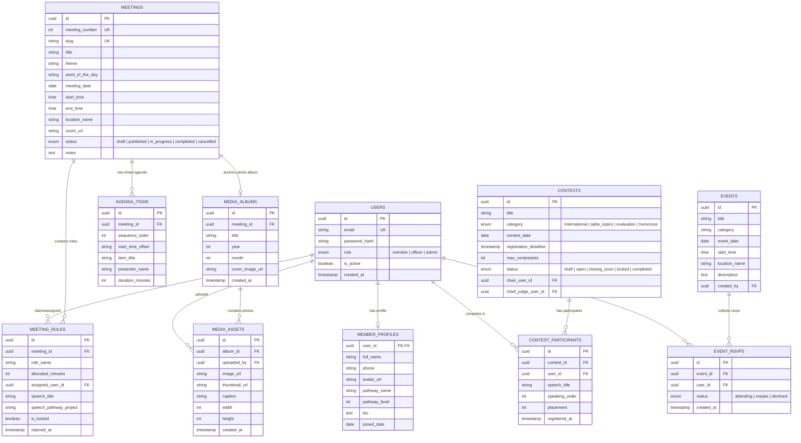

# TERRA — HOUR 02: INFORMATION ARCHITECTURE, GATED ROUTING & CONTENT GRAPH
## Confidential Internal Specification • Terra Toastmasters Operating System

---

## 1. Master Information Architecture & Gated Sitemap

Terra employs a **strict, authenticated-first hierarchy**. There are no orphan or unauthenticated views. The root route (`/`) acts as a smart gateway, instantly redirecting unauthenticated traffic to `/auth/login` and routing authenticated members to their personalized workspace at `/portal`.

```mermaid
graph TD
    Root["Terra Gateway (/)"] --> AuthGuard{"Authenticated Session?"}
    
    AuthGuard -- "No" --> AuthTree["Authentication & Recovery (/auth)"]
    AuthTree --> Login["/auth/login (Secure Sign In)"]
    AuthTree --> Forgot["/auth/forgot-password (Reset Request)"]
    AuthTree --> Reset["/auth/reset-password (Token Confirm)"]

    AuthGuard -- "Yes" --> MemberTree["Member Portal (/portal)"]
    AuthGuard -- "Yes (Officer)" --> AdminTree["Admin & Officer Console (/admin)"]

    %% Member Surface
    MemberTree --> M_Dash["/portal (Next Meeting & Action Bento)"]
    MemberTree --> M_Meetings["/meetings (Schedule & Archive List)"]
    M_Meetings --> M_MeetingDetail["/meetings/[slug] (Session Roster & Live Agenda)"]
    
    MemberTree --> M_Contests["/contests (Contest Hub & Categories)"]
    M_Contests --> M_ContestDetail["/contests/[id] (Participant Board & Hall of Fame)"]
    
    MemberTree --> M_Events["/events (Informal Meetups & Workshops)"]
    M_Events --> M_EventDetail["/events/[id] (Interactive RSVP & Details)"]
    
    MemberTree --> M_Gallery["/gallery (Chronological Media Archive)"]
    M_Gallery --> M_AlbumDetail["/gallery/[year]/[slug] (Session Photos & Lightbox)"]
    M_Gallery --> M_Upload["/gallery/upload (Batch Photo Ingestion Studio)"]
    
    MemberTree --> M_Directory["/members (Club Member Directory)"]
    MemberTree --> M_Profile["/portal/profile (My Speeches, Roles & Pathways)"]

    %% Admin Surface
    AdminTree --> A_Dash["/admin (Officer Command Center & KPI Bento)"]
    AdminTree --> A_MeetingBuilder["/admin/meetings/builder (Drag-and-Drop Agenda Studio)"]
    AdminTree --> A_RosterMgmt["/admin/meetings/manage (Role Override & Speaker Assign)"]
    AdminTree --> A_ContestMgmt["/admin/contests (Contest Setup & Winner Studio)"]
    AdminTree --> A_MemberMgmt["/admin/members (Member Directory & RBAC Assignment)"]
    AdminTree --> A_Announce["/admin/announcements (Broadcast Alert Studio)"]
```



---

## 2. Standardized RESTful Route Registry

```
┌──────────────────────────────┬────────────────────────┬─────────────┬─────────────────┬──────────────────────────────────────────┐
│ VIEW / MODULE                │ URL ROUTE              │ HTTP METHOD │ AUTH GUARD      │ CACHE / REVALIDATION STRATEGY            │
├──────────────────────────────┼────────────────────────┼─────────────┼─────────────────┼──────────────────────────────────────────┤
│ Smart Root Gateway           │ /                      │ GET         │ None (Redirect) │ No-cache (307 redirect to /portal/login) │
│ Member Login                 │ /auth/login            │ GET, POST   │ Public Only     │ Static / Client rendered                 │
│ Password Reset Request       │ /auth/forgot-password  │ GET, POST   │ Public Only     │ Static                                   │
│ Password Reset Confirm       │ /auth/reset-password   │ GET, POST   │ Token Guarded   │ No-cache                                 │
│ Member Home Dashboard        │ /portal                │ GET         │ Member / Admin  │ SSR with 30s ISR revalidation            │
│ Meeting Schedule & Archive   │ /meetings              │ GET         │ Member / Admin  │ ISR (revalidate: 60s)                    │
│ Meeting Detail & Role Roster │ /meetings/[slug]       │ GET         │ Member / Admin  │ On-Demand Revalidation on role claim     │
│ Contest Hub & Categories     │ /contests              │ GET         │ Member / Admin  │ ISR (revalidate: 60s)                    │
│ Contest Detail & Standings   │ /contests/[id]         │ GET         │ Member / Admin  │ On-Demand Revalidation on signup/score   │
│ Informal Events & Workshops  │ /events                │ GET         │ Member / Admin  │ ISR (revalidate: 120s)                   │
│ Event Detail & RSVP          │ /events/[id]           │ GET         │ Member / Admin  │ On-Demand Revalidation on RSVP toggle    │
│ Master Media Archive         │ /gallery               │ GET         │ Member / Admin  │ ISR (revalidate: 300s)                   │
│ Session Photo Album          │ /gallery/[year]/[slug] │ GET         │ Member / Admin  │ ISR (revalidate: 300s)                   │
│ Photo Ingestion Studio       │ /gallery/upload        │ GET, POST   │ Member / Admin  │ Dynamic / Client rendered                │
│ Member Speech Portfolio      │ /portal/profile        │ GET, PATCH  │ Member / Admin  │ Dynamic (User session scoped)            │
│ Club Member Directory        │ /members               │ GET         │ Member / Admin  │ ISR (revalidate: 600s)                   │
│ Officer Command Center       │ /admin                 │ GET         │ Officer / Admin │ Dynamic (Role verified)                  │
│ Agenda Builder Studio        │ /admin/meetings/builder│ GET, POST   │ Officer / Admin │ Dynamic                                  │
│ Role Roster Manager          │ /admin/meetings/manage │ GET, PATCH  │ Officer / Admin │ Dynamic                                  │
│ Contest Management Studio    │ /admin/contests        │ GET, PATCH  │ Officer / Admin │ Dynamic                                  │
│ Member RBAC Administration   │ /admin/members         │ GET, PATCH  │ Officer / Admin │ Dynamic                                  │
│ Broadcast Announcement Admin │ /admin/announcements   │ GET, POST   │ Officer / Admin │ Dynamic                                  │
└──────────────────────────────┴────────────────────────┴─────────────┴─────────────────┴──────────────────────────────────────────┘
```

---

## 3. Relational Content Graph & Entity Models



---

## 4. Navigation Architecture & Topography

### 4.1 Desktop Top Navigation Bar (Fixed 64px)
Constructed with Apple-style frosted blur (`backdrop-blur-xl bg-white/80 dark:bg-[#161618]/80 border-b border-black/[0.08] dark:border-white/[0.08]`).

```
┌──────────────────────────────────────────────────────────────────────────────────────────────────┐
│  Terra •      [Dashboard]  [Meetings]  [Contests]  [Events]  [Gallery]  [Directory]   [🔍 ⌘K] [🔔 2] [Avatar ▼] │
└──────────────────────────────────────────────────────────────────────────────────────────────────┘
```

1. **Brand Cluster (Left)**:
   - Minimalist typographic wordmark: `Terra` in SF Pro Display Medium + glowing amber status dot (`•`). Clicking always routes to `/portal`.
2. **Segmented Navigation Dock (Center)**:
   - Fluid pill tab bar with animated sliding spring indicator behind the active destination:
     - `Dashboard` → `/portal`
     - `Meetings` → `/meetings`
     - `Contests` → `/contests`
     - `Events` → `/events`
     - `Gallery` → `/gallery`
     - `Directory` → `/members`
3. **Utility & Profile Cluster (Right)**:
   - **Global Search (`⌘K`)**: Quick command palette for finding meetings, speeches, members, or photo albums.
   - **Notification Center (`🔔`)**: Slide-over badge for role confirmations, 48h meeting reminders, and contest announcements.
   - **Officer Toggle Switch** *(Visible only to Officer/Admin roles)*: Instant toggle to enter the Admin Command Center (`/admin`).
   - **User Profile Dropdown**: Avatar with status dot → `My Profile & Speeches`, `Settings`, `Dark/Light Mode`, `Sign Out`.

---

### 4.2 Mobile Navigation & In-Meeting Dock (Fixed 72px)
Optimized for one-handed thumb reach on iPhone / Android devices.

```
┌──────────────────────────────────────────────────────────────────────────┐
│                             [MOBILE SCREEN CONTENT]                      │
├──────────────────────────────────────────────────────────────────────────┤
│    🏠 Home        📅 Meetings       🏆 Contests      📸 Gallery    👤 Profile  │
│  (/portal)       (/meetings)       (/contests)      (/gallery)    (/profile)   │
└──────────────────────────────────────────────────────────────────────────┘
```

1. **Destination 1 (Home)**: `/portal` — Next meeting hero card and quick actions.
2. **Destination 2 (Meetings)**: `/meetings` — Schedule, role signups, and live agendas.
3. **Destination 3 (Contests)**: `/contests` — Active contest cards and registrations.
4. **Destination 4 (Gallery)**: `/gallery` — Photo albums and 1-tap mobile upload trigger.
5. **Destination 5 (Profile)**: `/portal/profile` — Speech history and pathway progress.

---

## 5. URL State Management & Query Parameter Strategy

To ensure seamless browser history, shareable deep links, and state persistence, all filtering, sorting, and tab states are synchronized with URL query parameters:

```
┌──────────────────────┬──────────────────────────────────────────┬────────────────────────────────────────────┐
│ VIEW                 │ QUERY PARAMETER SYNTAX                   │ PURPOSE & DEFAULT BEHAVIOR                 │
├──────────────────────┼──────────────────────────────────────────┼────────────────────────────────────────────┤
│ Meetings List        │ /meetings?filter=upcoming&view=cards     │ filter: 'upcoming' (default) | 'past'      │
│                      │                                          │ view: 'cards' (default) | 'table'          │
├──────────────────────┼──────────────────────────────────────────┼────────────────────────────────────────────┤
│ Meeting Detail       │ /meetings/2026-08-18?tab=agenda          │ tab: 'roster' (default) | 'agenda' |       │
│                      │                                          │      'photos' | 'notes'                    │
├──────────────────────┼──────────────────────────────────────────┼────────────────────────────────────────────┤
│ Contest Hub          │ /contests?category=international         │ category: 'all' (default) | 'international'│
│                      │                                          │           | 'table_topics' | 'evaluation'  │
├──────────────────────┼──────────────────────────────────────────┼────────────────────────────────────────────┤
│ Media Gallery        │ /gallery?year=2026&month=08&mode=session │ year: '2026' (default current)             │
│                      │                                          │ mode: 'session' (default) | 'all_photos'   │
├──────────────────────┼──────────────────────────────────────────┼────────────────────────────────────────────┤
│ Lightbox Viewer      │ /gallery/2026/meet-142?photoId=asset_891 │ Opens instant modal overlay without losing │
│                      │                                          │ underlying album scroll position           │
├──────────────────────┼──────────────────────────────────────────┼────────────────────────────────────────────┤
│ Member Directory     │ /members?search=elena&pathway=dl         │ search: search string                      │
│                      │                                          │ pathway: pathway acronym filter            │
└──────────────────────┴──────────────────────────────────────────┴────────────────────────────────────────────┘
```

---

## 6. Hour 02 Completion Checklist & Sign-Off

- [x] **Gated Sitemap Hierarchy** mapped with 100% private route coverage and smart gateway redirect logic.
- [x] **RESTful Route Registry** defined across all 22 internal endpoints with HTTP methods, auth guards, and cache policies.
- [x] **Relational Entity Model (ERD)** codified with 10 core tables, data types, and foreign key cascades.
- [x] **Desktop & Mobile Navigation Topography** documented with Apple-inspired frosted surface aesthetics and 21st.dev segmented controls.
- [x] **URL State Synchronization Schema** specified for deterministic back-button navigation and deep linking.

---

*Hour 02 complete. Proceed to **Hour 03: Core User Flows, State Machines & Interaction Logic**.*
