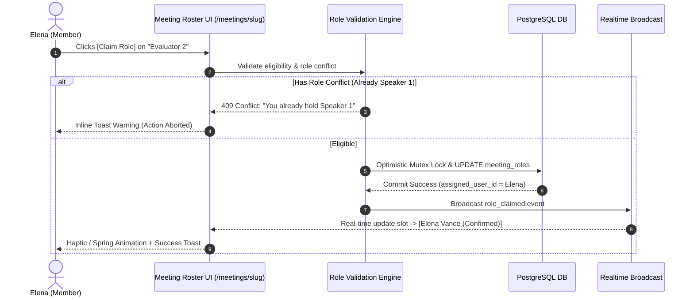
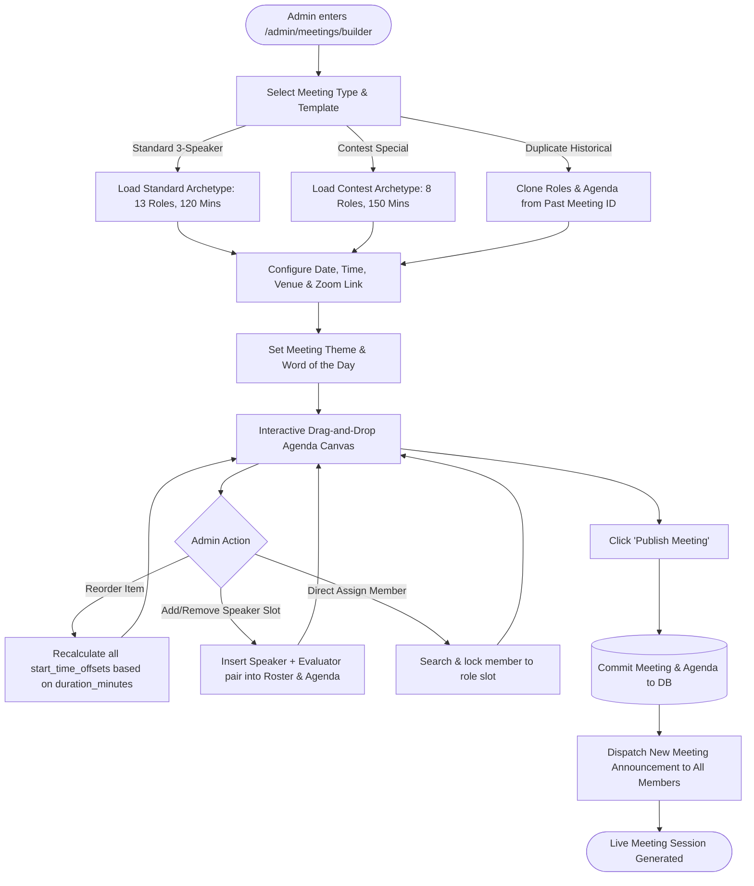
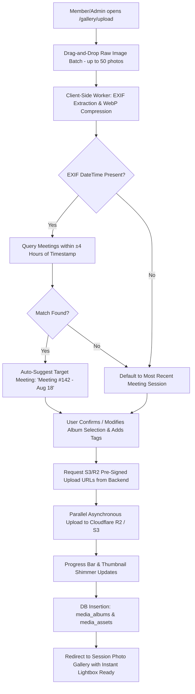
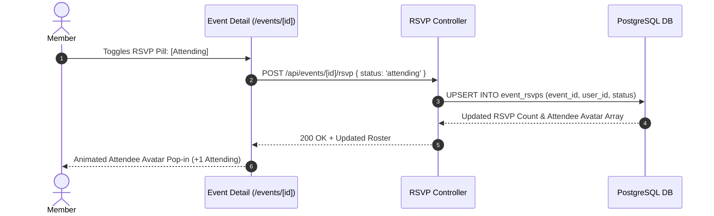
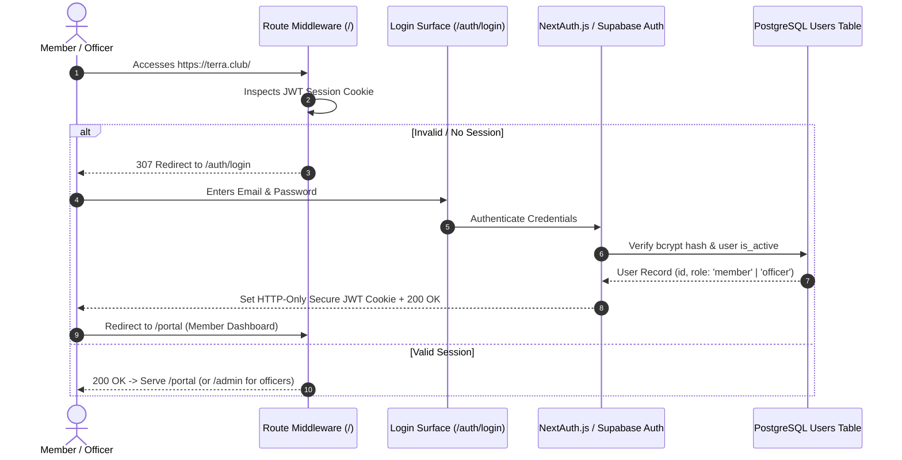

# TERRA — HOUR 03: USER FLOWS, STATE MACHINES & INTERACTION LOGIC
## Confidential Internal Specification • Terra Toastmasters Operating System

---

## 1. Master Flow Index & Interaction Architecture

This document formalizes the step-by-step user journeys, validation guards, rollback mechanics, and deterministic state machines powering the core Terra operating system.

```
┌──────────────────────────────────────────────────────────────────────────────────────────────────┐
│                                   TERRA CORE INTERACTION FLOWS                                   │
├──────────────────────────────────────────────────────────────────────────────────────────────────┤
│  • Flow 1: Self-Serve Meeting Role Claiming & Late Drop Guardrails                                │
│  • Flow 2: Admin Meeting Creation & Dynamic Drag-and-Drop Agenda Builder                         │
│  • Flow 3: Contest Lifecycle, Participant Signups & Winner Publication                           │
│  • Flow 4: High-Performance Batch Photo Ingestion & EXIF Auto-Matching                           │
│  • Flow 5: Informal Event RSVP & Attendee Roster Sync                                            │
│  • Flow 6: Authentication Gateway & Secure Session Recovery                                      │
└──────────────────────────────────────────────────────────────────────────────────────────────────┘
```

---

## 2. Flow 1: Self-Serve Meeting Role Claiming & Late Drop Guardrails

### 2.1 Happy Path: Claiming an Available Role


### 2.2 Role Drop & 48-Hour Late Cancellation Protocol
When a member clicks `Release / Drop Role`:
1. **Time Delta Evaluation**: System computes `Delta = meeting_start_time - current_timestamp`.
2. **Standard Drop (Delta >= 48 Hours)**:
   - System displays standard confirmation modal: *"Are you sure you want to release the role of Evaluator 2?"*
   - On confirmation, `assigned_user_id` set to `NULL`. Slot returns to green `[Claim Role]` state.
3. **Late Urgent Drop (Delta < 48 Hours)**:
   - System displays high-friction Apple-style alert sheet:
     > **⚠️ Late Role Cancellation**  
     > *This meeting commences in less than 48 hours. Dropping now impacts the club agenda.*  
     > - *Please coordinate with the Toastmaster of the Day.*  
     > - *An urgent vacancy alert will be dispatched to the Vice President Education.*  
     > `[Keep My Role]` &nbsp;&nbsp;&nbsp; `[Confirm Late Drop (Alert Officers)]`
   - On confirmation:
     - `assigned_user_id` set to `NULL`.
     - Slot flagged with pulsing amber badge: `Urgent: Vacant Role`.
     - Automated webhook / notification dispatched to VPE and TMOD dashboard.

---

## 3. Flow 2: Admin Meeting Creation & Dynamic Agenda Building



### Automatic Agenda Time Calculation Algorithm
Every agenda item contains `duration_minutes`. The system maintains a deterministic timeline:
$$\text{ItemStartTime}_{n} = \text{MeetingStartTime} + \sum_{i=1}^{n-1} \text{duration\_minutes}_i$$
When any item duration is edited or blocks are dragged to new positions, all downstream offsets recalculate instantly in client state before saving.

---

## 4. Flow 3: Contest Lifecycle & Registration State Machine

```mermaid
stateDiagram-v2
    [*] --> Draft: Officer initializes contest in Admin Console
    Draft --> Open: Officer clicks 'Open Registration'
    
    Open --> ClosingSoon: Current Time >= (Deadline - 48 Hours)
    note right of ClosingSoon: Dashboard displays countdown banner & badge
    
    ClosingSoon --> Locked: Deadline passed OR max_contestants reached
    note right of Locked: Registration disabled; contestant roster frozen
    
    Locked --> Live: Contest Chair starts contest event
    note right of Live: In-meeting scoring active; speaking order displayed
    
    Live --> Completed: Chief Judge enters validated placements (1st, 2nd, 3rd)
    Completed --> Archived: Winners published to Club Hall of Fame
    Archived --> [*]
```



### Contest Registration Rules:
1. **One Entry Per Member**: A member can only register once per contest category. Attempting a second entry is blocked by database constraint `UNIQUE(contest_id, user_id)`.
2. **Cap Enforcement**: If `max_contestants = 8` and 8 slots are confirmed, the 9th registrant is placed into the `Waitlist` queue.
3. **Automated Promotion**: If a confirmed contestant withdraws prior to `Locked` state, `Waitlist #1` is automatically promoted to `Confirmed` and notified via email/push.
4. **Speaking Order Randomization**: Kept obscured until the Contest Chair triggers the `Randomize Speaking Order` action in the Officer Console, assigning numbers `1` through `N`.

---

## 5. Flow 4: High-Performance Batch Photo Ingestion & Auto-Filing



---

## 6. Flow 5: Informal Event & Workshop RSVP Engine



---

## 7. Flow 6: Authentication Gateway & Secure Session Recovery



---

## 8. Comprehensive 14-Point UX Edge Case & Conflict Resolution Matrix

```
┌─────┬────────────────────────────────────────┬───────────────────────────────────────────────────────────────────────────┐
│ #   │ SCENARIO / EDGE CASE                   │ DETERMINISTIC UX & SYSTEM BEHAVIOR                                        │
├─────┼────────────────────────────────────────┼───────────────────────────────────────────────────────────────────────────┤
│ 01  │ Concurrent Role Claiming (Race Cond.)  │ Server assigns lock to first millisecond timestamp; 2nd user receives     │
│     │                                        │ animated toast: "Role was just claimed by [Name]. Here are open slots."   │
├─────┼────────────────────────────────────────┼───────────────────────────────────────────────────────────────────────────┤
│ 02  │ Multi-Role Double Booking              │ User holding Speaker 1 cannot claim Evaluator or TMOD in same meeting.    │
│     │                                        │ Conflicting buttons are disabled with explanatory hover tooltip.          │
├─────┼────────────────────────────────────────┼───────────────────────────────────────────────────────────────────────────┤
│ 03  │ Late Role Drop (<48 Hours)             │ High-friction modal warning requiring explicit confirmation. Triggers     │
│     │                                        │ high-priority officer alert and marks slot with amber 'Urgent Vacant' tag│
├─────┼────────────────────────────────────────┼───────────────────────────────────────────────────────────────────────────┤
│ 04  │ Meeting Cancellation                   │ Soft-cancellation: Status -> 'cancelled'. Agenda preserved; all claimed  │
│     │                                        │ roles released; banner posted on dashboard; alert sent to participants.   │
├─────┼────────────────────────────────────────┼───────────────────────────────────────────────────────────────────────────┤
│ 05  │ Meeting Rescheduling (Date/Time Change)│ Modifying meeting date automatically triggers an in-app prompt asking     │
│     │                                        │ assigned role-holders to re-confirm availability for the new date.        │
├─────┼────────────────────────────────────────┼───────────────────────────────────────────────────────────────────────────┤
│ 06  │ Contest Capacity Exceeded              │ When max_contestants is reached, signup button transitions to             │
│     │                                        │ 'Join Waitlist'. Waitlisted users are auto-promoted upon cancellations.   │
├─────┼────────────────────────────────────────┼───────────────────────────────────────────────────────────────────────────┤
│ 07  │ Contestant Withdraws from Contest      │ If confirmed contestant cancels, Waitlist #1 is promoted to Confirmed;    │
│     │                                        │ speaking order is regenerated if prior to briefing draw.                 │
├─────┼────────────────────────────────────────┼───────────────────────────────────────────────────────────────────────────┤
│ 08  │ Photo Upload with Missing EXIF Data    │ If EXIF timestamp is missing or corrupted, UI defaults target session to  │
│     │                                        │ the latest past meeting, with a 1-click dropdown to change session album. │
├─────┼────────────────────────────────────────┼───────────────────────────────────────────────────────────────────────────┤
│ 09  │ Photo Upload Network Interruption      │ Client-side uploader uses chunked upload retry logic. Interrupted assets  │
│     │                                        │ show an orange 'Retry Upload' button without restarting completed photos. │
├─────┼────────────────────────────────────────┼───────────────────────────────────────────────────────────────────────────┤
│ 10  │ Unauthorized Route Access (RBAC Guard) │ Regular member attempting to access /admin is intercepted by middleware   │
│     │                                        │ and redirected to /portal with a subtle 'Access Restricted' toast.        │
├─────┼────────────────────────────────────────┼───────────────────────────────────────────────────────────────────────────┤
│ 11  │ Password Reset with Expired Token      │ Token expired (>60 mins) triggers an Apple-style error card:             │
│     │                                        │ "This password reset link has expired" with a 1-click 'Request New Link'. │
├─────┼────────────────────────────────────────┼───────────────────────────────────────────────────────────────────────────┤
│ 12  │ Inactive / Deactivated Member Login    │ User flagged is_active = false receives clean error state:               │
│     │                                        │ "Your Terra account is inactive. Please contact your club VP Membership." │
├─────┼────────────────────────────────────────┼───────────────────────────────────────────────────────────────────────────┤
│ 13  │ Meeting Agenda Minute Overflow         │ If sum(duration_minutes) > allocated meeting window (e.g. 135m in 120m),  │
│     │                                        │ admin builder shows a red header warning: "Agenda overflows by 15 mins."  │
├─────┼────────────────────────────────────────┼───────────────────────────────────────────────────────────────────────────┤
│ 14  │ Offline Connectivity in Meeting Venue  │ Mobile app caches the latest agenda and roster locally via IndexedDB.     │
│     │                                        │ If connection drops, banner displays: "Offline Mode • Showing cached view"│
└─────┴────────────────────────────────────────┴───────────────────────────────────────────────────────────────────────────┘
```

---

## 9. Hour 03 Completion Checklist & Sign-Off

- [x] **Role Claiming & 48h Late Drop Protocol** formalized with sequence diagrams and warning modals.
- [x] **Admin Agenda Builder & Time Calculation Algorithm** mapped with drag-and-drop mechanics.
- [x] **Contest Lifecycle State Machine** codified from `Draft` through `Archived Hall of Fame`.
- [x] **High-Performance Batch Photo Ingestion Flow** documented with EXIF auto-matching.
- [x] **Informal Event RSVP & Auth Gateway Sequences** fully specified.
- [x] **Comprehensive 14-Point UX Edge Case & Conflict Resolution Matrix** completed.

---

*Hour 03 complete. Proceed to **Hour 04: Visual Design System, Design Tokens & Component Foundations (Apple + 21st.dev)**.*
